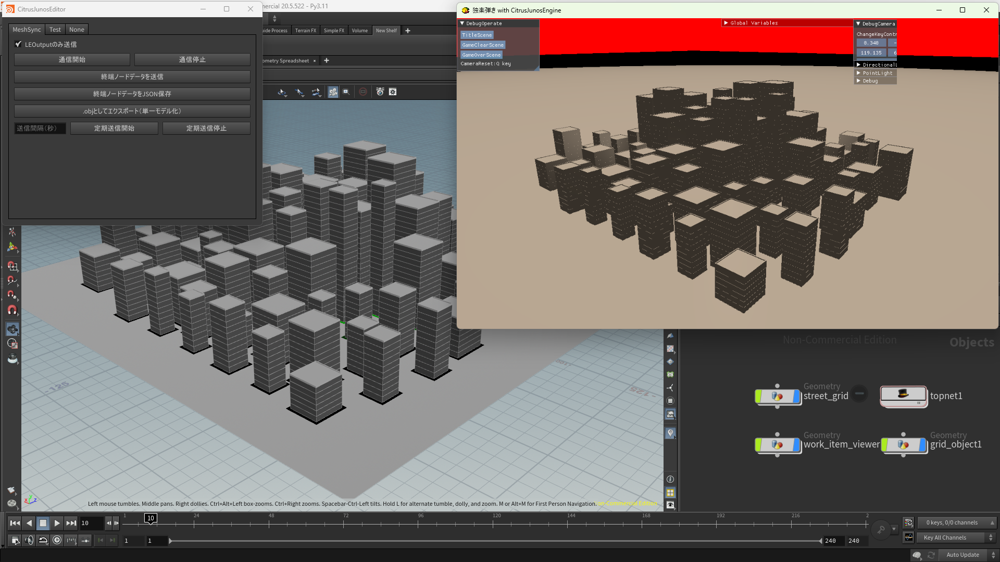

# CitrusJunosEngine
## DirectX12を使用したゲームエンジンです
- 描画パイプラインの構築から実際のゲームシーンまで個人で開発しています

# 工夫点
## オブジェクト配置およびメッシュの同期機能(メッシュシンク)
- エンジンとHoudini間でTCP通信を用いてデータの送受信を行っています

* [コード(受信)](Engine/base/components/utilities/dataReceipt/DataReceipt.cpp)
* [コード(解析&描画)](Engine/base/components/3d/Receipt3D.cpp)

* [コード(Houdini側ツール)](Tools/HoudiniPlugin/LevelEditorTool/__shelf_tool_LevelEditor.py)